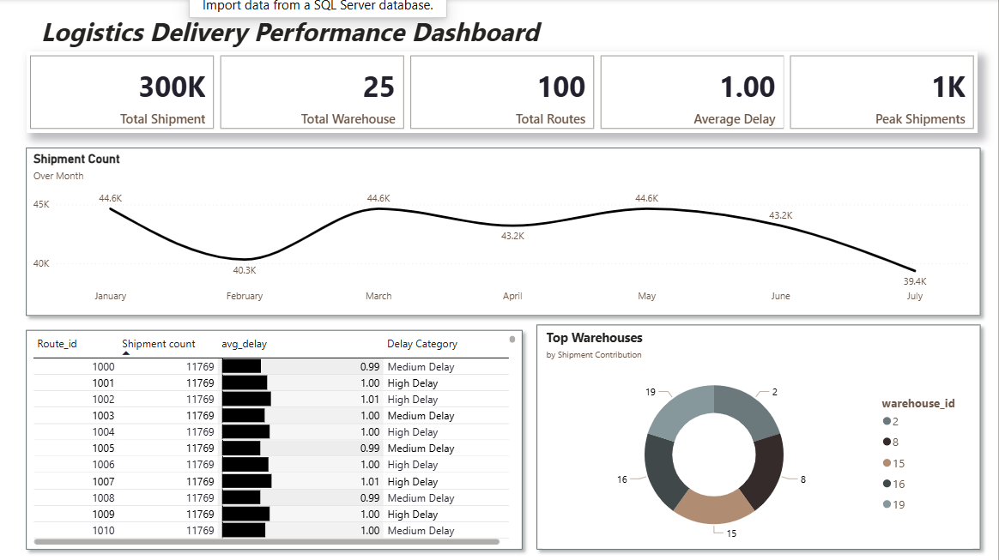

# Logistics Delivery Performance Analytics (Big Data Project)

## Project Overview

This project analyzes logistics shipment data to evaluate delivery performance, warehouse workload, and shipment demand trends.

A synthetic logistics dataset containing **300,000 shipment records** was processed and analyzed using **PySpark, SQL, and Power BI** to simulate a real-world logistics analytics workflow.

The objective of this project is to demonstrate how logistics datasets can be processed and transformed into actionable insights for supply chain operations.

---

## Tools & Technologies

* **Python (PySpark)** – Data processing and feature engineering
* **SQL (MySQL)** – Data analysis and queries
* **Power BI** – Data visualization and dashboard creation

---

## Dataset

**Total Records:** 300,000 shipments

### Dataset Fields

* `shipment_id` – Unique shipment identifier
* `route_id` – Logistics route identifier
* `warehouse_id` – Warehouse location identifier
* `distance_km` – Shipment distance
* `avg_speed_kmph` – Average vehicle speed
* `departure_date` – Shipment departure date

### Derived Fields

* `eta_days` – Estimated time of arrival
* `ata_days` – Actual time of arrival
* `delay_days` – Delivery delay (ATA − ETA)

The dataset was generated to simulate real logistics shipment activity.

---

## Data Processing Steps

### 1. Data Processing (PySpark)

The dataset was processed using PySpark.

Key steps:

* Load raw logistics dataset
* Calculate ETA based on distance and vehicle speed
* Generate ATA values
* Compute delivery delay
* Aggregate shipment data for analysis

---

### 2. Data Aggregation

Aggregated datasets were created for analysis:

* **route_delay_summary** – Average delay per route
* **warehouse_volume** – Shipment volume handled by each warehouse
* **shipment_trend** – Shipment demand trend over time

---

## SQL Analysis

### Route Delay Analysis

Identifies routes with the highest average delivery delays.

### Warehouse Shipment Volume

Calculates shipment volume handled by each warehouse.

### Shipment Trend Analysis

Tracks shipment activity across dates to analyze demand patterns.

---

## Power BI Dashboard

An interactive Power BI dashboard was created to visualize logistics performance.

### Key Visualizations

* **Route Delay Analysis** – Routes with the highest average delay
* **Warehouse Shipment Distribution** – Shipment share handled by each warehouse
* **Shipment Demand Trend** – Shipment activity over time

---

## Dashboard Preview

Logistics Delivery Performance Dashboard

---

## Key Insights

* Some routes show higher delivery delays compared to others.
* Shipment distribution varies across warehouses.
* Shipment activity fluctuates across dates.

These insights help logistics teams identify inefficiencies and improve supply chain operations.

---

## Conclusion

This project demonstrates how logistics shipment datasets can be processed using **PySpark**, analyzed using **SQL**, and visualized using **Power BI** to generate operational insights for logistics and supply chain management.
